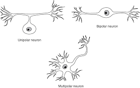

# Cellular Neurobiology
## 8-23 Notes
* Textbook not required but recommended.
* Make 2 copies of HW, one to keep one to hand in
* May move to UU 109 - Keep an eye out
* Neurobiology - study of neurons

### Simple neural circuit - Knee jerk reflex

  * **Patellar Stretch Reflex** - Maintains specific tension and length of quadriceps muscle
      * Tapping below the knee stretches the muscle, contracts to regain original length, foot swings
      * In muscle, stretch is detected by sensory neuron
          * Neuron exists in ganglion, extends a process out to the muscle to sense
      * **Ganglion** - structure containing a number of nerve cell bodies, physical expansion of spinal chord, connects processes out to muscles.
      * **Dorsal root ganglion** - contains the cell bodies of sensory neurons that bring information from the periphery to the spinal cord. Used in stretch reflex
      * **Ganglion/nucleous** - A collection of nerve cell bodies
      * **Process** - (neurite) extends from ganglion to muscle (term used instead of axon/dendrite)
      * CNS - Spinal chord
          * White matter and gray matter (cross section image)
      * **Sensory Neuron** - Detects signals from environment, sends a process to the CNS into the inner gray matter
          * Then interacts with a second neuron at synapse, *motor neuron*
      * **Pre-Synaptic** - Sensory neuron endings, releases neurotransmitters
      * **Post-Synaptic** - Motor neuron, receives neurotransmitters
      * **Motor neuron** - exists in gray matter of spinal chord, sends signals to muscle via process from CNS
      * **Synaptic cleft** - gap, interacts with receptors on post-synaptic cell
      * Motor neuron's response travels out of the CNS to muscle via a process, here it becomes a pre-synaptic contact with the now post-synaptic muscle.
      * Signal leads to contraction
      * Motor neuron then extends a process back to the muscle
      * **Nerre** - Collection of processes, bundle of sensory and motor fibers
      * **Afferent** - incoming signal to CNS - *dorsal root*
      * **Efferent** - outgoing signal from CNS - *ventral root*
      * **Sensory neuron** - synapses with motor neuron are on the motor neuron's *dendrites*
      * **Motor neuron** - extends an *axon* out to the muscle
      * Neuron has *resting potential* - electrical difference between interior and outside. When electrical potential changes,this signal can be sent through the neuron and to the next neuron in line
      * ACH -  neurotransmitter in the preganglionic sympathetic and parasympathetic neurons

### The Neuron

  * What differs neurons from other cells - Shapes
  * **Shapes of neurons** - reflect who they're connected to (long processes for motor neurons can be 3ft long), where they receive inputs and where they send them
  * **Anaxonal neuron** - Difficult to distinguish between inputs and outputs, no obvious axon
  * **Monopolar** - (unipolar) only one process extends from body
  * **Bipolar** - Branch goes up one way and down another
  * **Multipolar neuron** - classic neuron, cell body with dendrites on body and single axon
  * **Interneurons** - process signals between sensory and motor neurons
