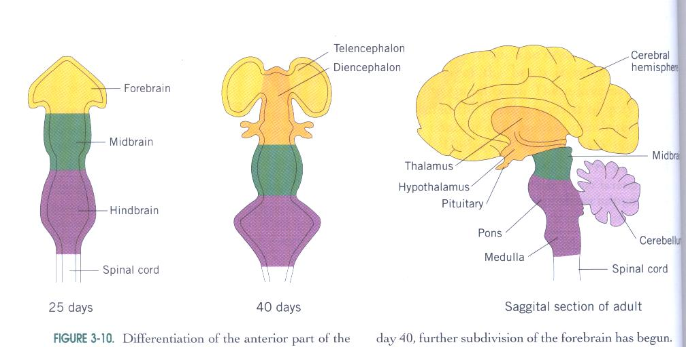
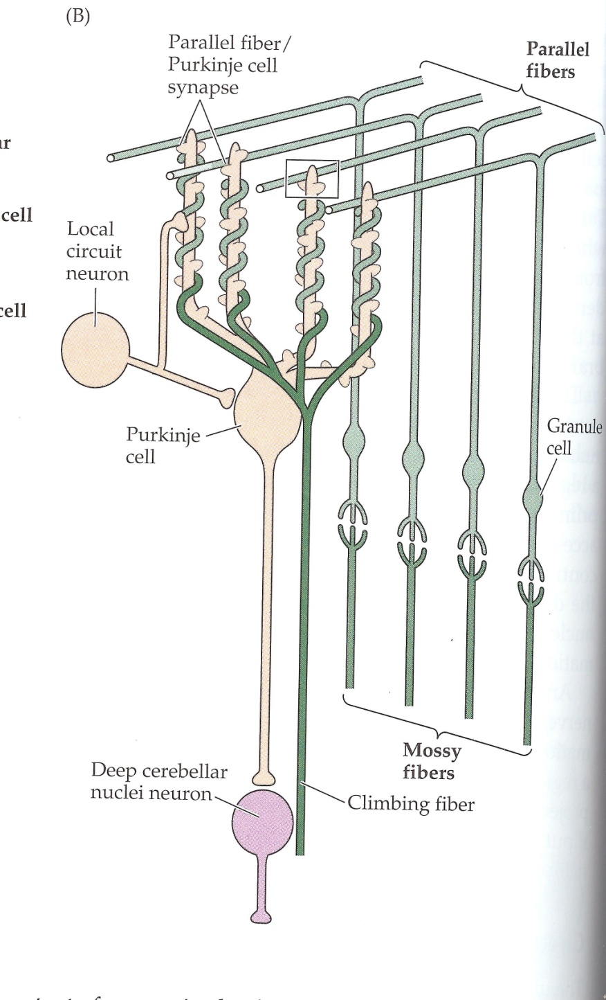
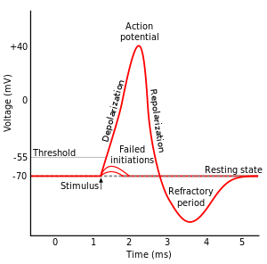

# Cellular Neurobiology

## Simple neural circuit - Knee jerk reflex

  * **Patellar Stretch Reflex** - Maintains specific tension and length of quadriceps muscle
      * Tapping below the knee stretches the muscle, contracts to regain original length, foot swings
      * In muscle, stretch is detected by sensory neuron
          * Neuron exists in ganglion, extends a process out to the muscle to sense
      * **Ganglion** - structure containing a number of nerve cell bodies, physical expansion of spinal chord, connects processes out to muscles.
      * **Dorsal root ganglion** - contains the cell bodies of sensory neurons that bring information from the periphery to the spinal cord. Used in stretch reflex
      * **Ganglion/nucleous** - A collection of nerve cell bodies
      * **Process** - (neurite) extends from ganglion to muscle (term used instead of axon/dendrite)
      * CNS - Spinal chord
          * White matter and gray matter (cross section image)
      * **Sensory Neuron** - Detects signals from environment, sends a process to the CNS into the inner gray matter
          * Then interacts with a second neuron at synapse, *motor neuron*
      * **Pre-Synaptic** - Sensory neuron endings, releases neurotransmitters
      * **Post-Synaptic** - Motor neuron, receives neurotransmitters
      * **Motor neuron** - exists in gray matter of spinal chord, sends signals to muscle via process from CNS
      * **Synaptic cleft** - gap, interacts with receptors on post-synaptic cell
      * Motor neuron's response travels out of the CNS to muscle via a process, here it becomes a pre-synaptic contact with the now post-synaptic muscle.
      * Signal leads to contraction
      * Motor neuron then extends a process back to the muscle
      * **Nerre** - Collection of processes, bundle of sensory and motor fibers
      * **Afferent** - incoming signal to CNS - *dorsal root*
      * **Efferent** - outgoing signal from CNS - *ventral root*
      * **Sensory neuron** - synapses with motor neuron are on the motor neuron's *dendrites*
      * **Motor neuron** - extends an *axon* out to the muscle
      * Neuron has *resting potential* - electrical difference between interior and outside. When electrical potential changes,this signal can be sent through the neuron and to the next neuron in line
      * ACH -  neurotransmitter in the preganglionic sympathetic and parasympathetic neurons

## The Neuron

  * What differs neurons from other cells - Shapes
  * **Shapes of neurons** - reflect who they're connected to (long processes for motor neurons can be 3ft long), where they receive inputs and where they send them
  * **Anaxonal neuron** - Difficult to distinguish between inputs and outputs, no obvious axon
  * **Monopolar** - (unipolar) only one process extends from body
  * **Bipolar** - Branch goes up one way and down another
  * **Multipolar neuron** - classic neuron, cell body with dendrites on body and single axon
  * **Interneurons** - process signals between sensory and motor neurons
  * **Neuroglia (glial) cells** - 2-3 times as many than neurons. 5 kinds
    * **Astrogilia** - look like stars, common. Provide physical support and nutrients for neurons. Regulate k+ conc outside nervous system. Remove excess neurotransmitters from extracellular space.
    * **Radialgilia** - Around throughout life of org, important in development. Provide scaffold for migration of neurons.
    * **Microgilia** - immune response. made in bone marrow, highly mobile. clean up cellular debris, see a lot near infections or neurodegenerative diseases (Parkison's, Huntington's, Alzheimer's). Excessive activity during development may remove too many synapses leading to issues like possibly autism??
    * **Oligodenetroglia** - found in CNS (brain, spinal cord) only, generate _myelin_ (flattened cell membrane w/o plasma) from glial cell. Electrical insulator, allows action potentials to move quicker and more reliably. Each _oligodentrocyte_ myelinates several axons. Block axon regrowth on damage.
      * **Nodes of Ranvier** - nodes where AP are generated, gaps in myelin.
    * **Schwann cells** - glial cells outside the CNS, in the PNS. Provide myelin. Myelantes only _one_ axon. Takes own cell body and wraps around, squeezing out most cytoplasm. Help regenerate nerve damage.
    * Difference between _Schwann cells_ and _Oligodentrocyte_:
      * Schwann cells help regenerate nerve damage
      * Oligodentrocytes actually block axon regrowth. Complex issue.
        * Oligodentrocytes block axon regrowth because it prevents mistakes that could be made during regrowth.
    * **Similarities between gilia and neurons** -  Electrical potentials across membranes exist in both, Change in response to signals - electrical and neurotransmitters, Glial cells are electrically connected to each other and can be connected to neurons as well
    * **Differences between gilia and neuons** - Glial cells electrical potential changes are much smaller, Glial cells do not have AP, Glial cells have smaller cell bodies and are smaller

## Organization of Neural structure
  * Even single cell organisms have some type of nervous systems.
  * **Nerve net** - Networks of interconnected neurons, can have activity that spreads throughout the net. Found in Hydras.
    * Humans have similar arrangements of nerve cells in gut (peristalsis)
  * Most invertebrate animals have a brain and nerve cords, large ganglic along the nerve cord
  * Mammals and other vertebrates also have brain and nerve cord. also have ganglic
  * But invertebrate nerve cords run along the belly side, vertebrate along the _back_ and system is made from a tube and remains tube-like
  * Basic Organization
    * CNS - Brain + spinal cord
    * PNS - Nerves that run to and from organs and muscles, includes nerves and ganglia
    * **Enteric Nervous System** - network of neurons and ganglia on the gut
  * Brains integrate information from a collection of sensors at the front end of the animal

## Major parts of the brain
  * **Dorsal** - Back or top of animal
  * **Ventral** - Belly or bottom of animal
  * **Anterior** - Front, head
  * **Posterior** - Back, legs
  * **Rostral** - Toward the nose
  * **Coudral** - Toward the tail
  * **Lateral** - to the outside
  * **Medial** - Toward the midline
  * **Proximal** - used in reference to another object, closer object to intended object you are referring to
  * **Distal** - used in reference to another object, further object to intended object you are referring to
  * **Superior** - above (in brain)
  * **Inferior** - below (in brain)
  * Sections of the brain:
    * **Coronal** - sliced like a sausage, front and back of brain
    * **Saggital** - split down midline, corpus callusom, so you get two mirror image halves
    * **Transverse/Horizontal** - cut on plane parallel to ground while standing, split into top half and bottom half. Used in midbrain and spinal
  * Nervous system starts as a tube
    * As time progresses, portions of the tube develop in different ways

    
    * Starts with a tube with forrbrain, midbrain, hindbrain, and spinal cord
      * **_Forebrain_** - develops first. Telencephalon and Diencephalon.
        * **Telencephalon** - Part of forebrain. Higher mental functions. Processes sensory info and motor control. Two cerebral hemispheres connected by corpus callosum. Contains 4 lobes of the brain determined by brain folds
          * **Gyrus** - mountain fold of brain
          * **Sulcus** - Valley fold of brain
          * **Corpus callosum** - big myelinated bundle of axons that connects hemispheres
          * **Frontal lobe** - Personality, "higher mental functions"
          * **Parietal lobe** - Behind central sulcus
          * **Occipital lobe** - Back end of brain, visual processing
          * **Temporal lobe** - Ventral to other lobes, around your temples. Hearing and speech
          * **Basal ganglia** - Ganglia, interior of cortical folds (not part of cortex), important in postural adjustments and planning movements. Putamen, globus pallidus, caudate
          * **Lymbic system** - Amygdala, Hippocampus, Nucleus accumbens
            * **Amygdala** - area of emotion, rage, repulsion, fear
            * **Hippocampus** - Memory is formed
            * **Nucleus accumbens** - reward/pleasure circuit. Plays role in addiction, other non destructive behavior.
          * HM - surgery at age of 27, removed hippocampus, could not form new memories
          * **Olfactory bulb** - Chemical sensors in nose project to bulb, underside of brain. Neurons project to olfactory cortex.
        * **Diencephalon** - Part of forebrain. Thalamus, Lateral gerniculate, Medial geniculate, hypothalamus
          * **Thalamus** - Sensory processes and distributes most sensory and motor information to and from the Telencephalon
          * **Lateral gerniculate** - Visual processing, receives information from the retina, conveyed by the optic nerve.
          * **Medial geniculate** - Processes auditory information
          * **Hypothalamus** - below the Thalamus, important for homeostasis. Regulates hormone secretion using pituitary(body temp, blood pressure, salt balance), regulates behavior for eating drinking, thirst, salt consumption, shivering
      * **_Mesencephalon_** - Midbrain. Relay station for visual (superior colliculus), auditory (inferior colliculus), nuclei.
        * **Superior colliculus** - visual relay station in midbrain
        * **Inferior colliculus** - auditory relay station in midbrain
        * **Red nucleous** - relay station between cerebellum and fuebrain
        * **Subdtantia nigra** - postural and motor control nuclei, where cells die in parkinson's disease
      * **_Hindbrain_** -  2 devisions, Metencephalon and Myelencephalon
        * **Metencephalon** - Pons and cerebellum
          * **Pons** - Major fiber tract. Pathway to and from cerebellum and hindbrain. Has some nuclei which control respiration and sleep.
          * **Cerebellum** - Maintain muscle tone and balance. Helps in planning out movement smoothly. Motor memory. Receives information from cerebral cortex indirectly about planned movements. Receives info from cerebral cortex about sensory feedback from movement as well. Cerebellum compares these pieces of information to make sure movement happened correctly, generated correction
            * **Motor error** - signals indicate incorrect motion compared to intended motion in cerebellum, correction is then made
            * Output from _cerebellum_ is carried by the axons of the _Purkinje cells_, is inhibitory, goes to deep cerebellar nuclei. From here it goes to cerebral cortex where corrective movements are generated if needed.

            
            * **Pontire nucleous** - receive info about _intended_ movement. Extend out into mossy fibers which synapse with granule cells. Granule cells send up its own axon that synapse the _Purkinje cells_ using parallel fibers.
            * **Inferior olive of Myelencephalon** - Gets input about _actual_ movements, synapse with _Purkinje cells_ using climbing fibers, wrap dendrites.
            * **Deep cerebellum nuclei** - gets info from _Purkinje cells_ about actual and intended movements; output corrected movement is sent to motor cortex if needed.
            * Damage to cerebellum - intended movement is jerky
        * **Myelencephalon** - _Medulla oblongata_, continuation of spinal cord. Blood rate, breathing, coughing, gagging. Controls basic functions, required for survival.

## CNS
  * Coming off the brain on its ventral side are 12 cranial nerves, go between brain and periphery
    * **Optic nerve(II)** - lateral geniculate to eye
  * Spinal cord is CNS that is more directly innervating
  * x-section(transverse) - white matter(mylin axons) and grey matter(cell bodies)

  
  * Central canal, Dorsal horn and ganglia, ventral horn and ganglia
  * Spinal cord shows some basic features of the CNS
    * Tubular nature, continuous with ventricles in brain, central caral of spinal cord
      * filled with and surrounded by cerebrospinal fluid _CSF_
      Contains the correct ionic balance for neural functions and a few proteins
        * **Cerebrospinal fluid** - Produced from blood in _chorid plexus_ in addition to ionic balance, its important as a shock absorber
    * Grey and white matter
  * **Meninges** - Surrounding the CNS, set of 3 membranes
    * CSF bathes the CNS inside the meninges "sheath"
    * CSF reabsorbed at the meninges
  * **Blood brain barrier** - also regulates what ions/proteins reach brain. Capillary endothelial cells in CNS are joined by the tight junctions. Stuff cannot exit or enter these capillaries unless they pass through endothelial cells membrane using small lipid soluable molecules or transporters.
      * small lipid soluble molecules, water
      * Transporters in the cell membrane can move molecules
        * Glucose transporter
    * **Astrocytes** -  Secrete molecules/proteins to stimulate endothelial cells of capillaries to regulate tightness of tight junction, regulate permeability of blood brain barrier.
    * To get drugs to CNS, must deal with BBB
      * tiny and lipid soluble ok
      * or attach to nano-particles which get transported

## PNS - Autonomic nervous system
  * also includes peripheral nerves
  * 3 major divisions
    * Sympathetic
    * Parasympathetic
    * Enteric
    * For S and PS, many of the cell bodies are in the CNS
      * **Sympathetic** - Fight or flight responses. ACh and norepinephrine as NT
        * Preganglionic fiber, neurotransmitter is *ACH*
        * Postsynaptic cell in the sympathetic ganglion extends axon to organs (postganglionic fiber), long. Neurotransmitter is *norepinephrine*
          * **norepinephrine** - fight or flight, causes effects like inc hr, inc blood flow to muscles, sweat, inhibit digestion, mobilizes glucose, activates adrenal glands, dialates pupils.
      * **Parasympathetic** - Rest and digest responses. ACh only as NT.
        * nerve bodies in CNS but in brainstem and in the sacral region of spinal cord
        * sends axons (preganglionic fibers) out to ganglia which are close to or on the organ innervated
          * long preganglion fiber, short postganglionic fiber
        * *ACH* is neurotransmitter in ganglia, AND uses **ACh** postganglionic, not NE like in Sympathetic
          * rest and digest, inc blood to gut
          * reduces blood flow to muscles
          * slows hr
    * **Enteric**
      * Nerve net with ganglia throughout
      * Neurons interact with each other for peristalsis
      * Many neurotransmitters

## Anatonomy in neurons
  * **Neuronal membrane** - Phospholipid bilayer. Phosphate head is hydrophilic
  * Proteins can move a bit, some cant move that much.
  * Proteins in neurons
    * Transport proteins
    * Ion Channels
      * Can be gated - needed something to open
      * Ligand, voltage, stretch-sensitive
    * Membrane can have very different
      * [K+]out 3mM, [K+]in 90mM
      * By diffusion, prefers to exit(concentration), but prefers to stay inside because its more negative (electrical gradient)
      * _Nernst equation_ is used here - calculate membrane potential based on [ions] inside and outside cells
      * membrane potential **Vm** -  constant * ln( [k+]out/[k+]in ), 8.31 j/mol*K, Rt/zf
        * t is temp in K (273+celcius, ~293)
        * z = valance of ions
        * F - faraday's constant 96500 C/mol
        * **Constant of 25 mv** - assuming temp is 20C and valance of 1. Needs to be multiplied by ln of concentration gradient
          * 25mV ln( K+out/k+in)
          * if permiable membrane,  this is the potential.
          * example : (25mV)ln( 3mM/90mM) = -85mV
            * use 58 instead of 25 if use log base 10
            * 58 log([ion]out/[ion]in)
          * usual mammalian cells have out 106mM,in 4mM
      * The **driving force** - tells you the strength of the forces acting on each ion, it is the difference between the membrane potential and the ion's equilibrium potential. df = V_m - E_ion (membrane potential - equilibrium potential)
       * The direction of the ion inside or out of the neuron depends on the sign of the driving force and the charge of the ion
       * When you calculate the driving force, assume this is the value of the ion
         * "Sees" inside of the neuron
           * \+ repels + ion, attracts - and vice versa
  * Permeable to 3 ions: Na+, K+, and Cl-   
    * at rest, neuron is permeable to K+ and Cl-
    * resting potential is not the same as the equilibrium potential for K+
    * Driving force pushes K+ out
    * Na+ has strong driving force, can leak a little when channels are not open
    * **Na+/K+** - pump to counteract leak. Removes 3 Na+ from cell, brings in 2K+, uses 1 ATP
  * Membrane potential is not = to equilibrium potential  
    * Na+, K+, Cl- are important for determining membrane potential, Vm, because they pass through specific ion channels in the membrane
    * Each ion has a specific permeability though the membrane
    * Permeability to an ion is a factor in what the Vm would be.
    * To factor in permeability, we talk about _relative permeability_ - relative to K+ permiability PK+:PNa+:PCl-
      * squid axon at rest - PK+:PNa+:PCl- ; 1:0.4:0.45
      * How to determine Vm at rest?
      * use [ions] and P_ions using *goldman equation (constant field equation)*
      * **Membrane potential at rest** = 58 log([ (Pk+)[K+]out * (PNa+)[Na+]out * (PCl-)[Cl-]in ]/[ (Pk+)[K+]in * (PNa+)[Na+]in * (PCl-)[Cl-]out ])
      * Why is cl in/out? - because -log a/b = logb/a
      * Given K+:Na+:Cl- permeability ratio 1:0.4:0.45 and concentrations of 20mM,400mM:440mM,50mM:560mM,51mM
        * > Vm = 58 log([ 20mM * (0.4)440mM * (0.45)51mM ]/[ 400mM * (0.4)50mM * (0.45)560mM ])
        * > Vm = -59.9mV

      * Suppose cell is only permeable to k+, 1:0:0
        * > Vm = 58 log([ 20mM * (0)440mM * (0)51mM ]/[ 400mM * (0)50mM * (0)560mM ])
        * > Vm = 58 log([ 20mM ]/[ 400mM ])
        * > Vm = 58 log( [K+]out / [K+]in ), nernst equation

      * In an action potential, PNa+ increases dramatically
        * 1:20:.45, Na+ is 20 times more permeable
        * > Vm = 58 log([ 20mM * (20)440mM * (0.45)51mM ]/[ 400mM * (20)50mM * (0.45)560mM ])
        * > Vm = +42 mV
        * Large difference during AP from -60 to 42

      * **Action potential** - come about as there is a transient increase in PNa+. Not for long, ~1msec
        * Vm over time
        * **AP steps** - start at -60(Resting), spike up positive(depolarization), Peak(overshoot), Falling phase(repolarization), dip back below -60(undershoot/hypopolarization) for a split second, back to -60(Resting) all in 1msec
        * Called spikes
        * 
      * All or none is valid, but there are degrees of AP
      * AP occur when Vm reaches **threshold** - unstable equilibrium for neurons, -20mV
        * **Na+ channels** - are gated by voltage
        * at -60mV, most Na+ channels are closed, at -40, some channels will be triggered and open
        * However membrane is permeable to K+, and this will be further from Ek+ so driving force on K+ is large and k+ exits to counteract this Vm and Vm will return to rest.
        * At threshold (-20 mV), equal number of Na+ entering the cell(voltage gated open up) as K+ leaving the cell (through k+ leakage channels)
        * one more Na+ entering tips the balance of open Na+ channels that cause many more to enter a + feedback loop,
        * Vm becomes more positive -> opening Na+ channels -> Na+ exits neuron -> Vm becomes more positive
        * Vm will rapidly become more positive until Vm nears Ena+(equilibrium)
        * **Peak of AP** -  Vm nears Ena+(equilibrium) around +42
        * Vm rapidly declines after reaching this peak
          * sodium channels close quickly after opening
          * Voltage gated k+ channels opening, driving force is large (-75)
          * 82 mV - (-75mV) = +117 mV Driving force
          * k+ want to leave, which drops the VM back down
          * As AP Vm goes down, Na+ channels are almost all closed
          * V-gated k+ channels and k+ leak channels are opening
            * Vm reaches Ek+, Vm reaches lowest point here at undershoot
          * V-gated Na+ channels start to reopen and k+ v-gated channels start to close, reach equilibrium again
          * During the refractory period, neuron will not fire without a large Vm.
        * How do we know Na+ is responsible for the AP
          * Change [Na] out or in to look at the effects on AP
          * The amount of Na that actually passes through the membrane is small per AP, Need to fire 300K AP to double Na+ inside the cell

          -------------- Test 1 material done---------------

* Na+ is 20 times more permeable than K+ at AP - how do we know?
  * **Voltage clamp** - allows you to measure how permeable a membrane is and how ions are moving across it in real time. 2 electrodes needed inside cell. One to measure Vm, one to pass current.
    * one electron to measure Vm - info sent to voltage clamp circuitry
    * **Command voltage** - you tell the circuitry what you want Vm to be
    * **voltage clamp circuitry** - look at Vm is, where you set it (command voltage), then pass current into cell to make them match using the second electrode
    * What you read out of the _voltage clamp_ is the _current_ it must pass into the cell to hold Vm at a certain level
    * Counteract current(I) from increased Vm from clamp. if AP threshold is not met, current only slightly changes to oppose current. Above threshold it activates an AP
    * Current over time plot:
    (IMAGE) instead of Vm over time of an AP, in a voltage clamp where we set Vm above threshold:
      * I over time, outward above 0, inward below 0

    * **Current during action potential measured by clamp:**


```
            |           / ------------- \
            |          /                 \
        I  0|-------------------------------------------------
            |  \ ----/
            |
```

* **Set Vm to -40 in squid (below threshold at -20)**

```
            |
        Vm  |   |---------|(-40)
            |---|         |---------(-60)
            |
            |---------------------------

            |           
            |         
        I  0|-------------------------------------------------
            |   \--------/''''' (Overall inward current)
            |
```

* Set above threshold

```
            |   |---------|(-20)
        Vm  |   |         |
            |---|         |---------(-60)
            |
            |---------------------------
                         __________
            |           /          \
            |          /            \ (Sustained outward)
        I  0|-----------------------------------------------
            |   \____/ (initial inward of Na)
            |
```

* **Set Vm to +26mV**
  * compared to previous, smaller inward current and larger outward current
    * because driving force on Na+ when Vm is +26
      * df = vm - E_ion
      * 26mV - 55 = -29mV
    * while at -20mV for Vm
      * df = -20 - 55 = -75mV
    * For Na+, driving force is less at +26mV so inward current it carries is less
    * BUT for K+, at Vm = -20, df is -20 -(-75) = +55mV
      * but when Vm = +20mV
      * df is 26mV -(-75) = +101mV, Much bigger!!


```
            |   |---------|(+26)
        Vm  |   |         |
            |   |         |
            |---|         |---------(-60)
            |
            |---------------------------

                          ________
            |            /        \
            |           /          \
            |          /            \ (Larger sustained outward)
        I  0|-----------------------------------------------
            |   \----/ (smaller initial inward of Na)
            |
```

* **Set Vm to +55mV or Driving force of Na+(ENa+)**
  * df = 55-55 = 0 mV
  * No inward current at all but a large outward current because we are even further from eq potential for K+


```
            |   |---------|(+55)
        Vm  |   |         |
            |   |         |
            |---|         |---------(-60)
            |
            |---------------------------

                          ________
            |            /        \ (K+ leaves)
            |           /          \
            |          /            \ (Even larger sustained outward)
        I  0|-----------------------------------------------
            |   (Na+ neither comes in or leaves)
            |
```

* **Set Vm to +65, 10 mB more positive that Ena+**
  * df = 65 - 55 = +10mV
  * Two outward currents

```
                             ________
            |               /        \
            |           __ /          \ ( K+ leaves)
            |          /               \ (Even larger sustained outward)
        I  0|-----------------------------------------------
            |        ( ^ Na+ leaves)
```


* You can determine resistance of membrane V = IR - ohms law
* Conductance is the inverse of resistance:  G = (1/R)
* By calculating G over AP, you can see:
  * Conductance of Na+ high at beginning of AP, lower later during AP - V-gated channels and soon close
  * K+ conductance high and peaks later than Na+ in AP - V-gated channels open with a slight delay and stay open for a while

-- missed lecture --

* Patch clamp records 100's of brief recordings that show activities of a few channels in presence of TEA, to block K+
  * See these at various times in different recordings, but if you sum up the activity over 100s of these recordings, it looks like a 'typical' TEA treated inward current

```
            |         
        I  0|-----------------
            |    |-|   (Brief inward current that turns on and off)
            |          


            |         
        I  0|-----------------
            |    \___/   (Typical TEA treatment inward current)
            |
```


* Block channels with TTX - Patch clamp with voltage clamp conditions well above threshold
  * Confirms that A.P. is due to an inward current carried by Na+ that shuts off, a slightly delayed outward current carried by K+ that is long lasting

```
                  ____________
      out   |    /            (long lasting outward current)
           0|-----------------
      in    |    
            |          

            |    |-|      (individual channels are opening longer than Na+ channels a lot)
           0|-----------------
            |    
            |     
```

* **4 types of v-gated channels have been identified** - Na+, K+, Ca++, Cl-
* K+ are most varied in properties
* Molecular features of ion channels  
  * membrane spanning regions - with repeated spars
  * a central pore for ions to pass through
  * a loop of amino acids lining the pore, which aids selectivity of the channels
  * also for selectivity, have a constricted region called the selectivity filter
  * some kind of gate that can be opened and closed
    * selectivity can be based on ion size
      * for Na+ and K+ usually hold H20 tightly, Na+ carries 3+ water molecules, K+ carries 2.
      * **We can restrict Na+ from a K+ channels using** - small size, even though Na+ is technically smaller than K+. Water molecule binding(Na+ carries 3+ water molecules, K+ carries 2)
      * **We can restrict K+ from a Na+ channels using** - Magic. Still unknown
      * Na+ channels:
        * a single protein transcribed from one generate
          * 6 membrane spanning regions, each organized 4 domains arranged in a ring with a pore down the center
        * Voltage sensor may be the S4 helix found in each domain. It is covered in pos charged lysine.
          * when interior of cell (Vm) becomes more positive, S4 helixes are repelled and move, opening the channels
        * Have 2 gates
          * Activation gate - opens as soon as Vm becomes more (+), Na+ passes through the channel
          * But the activation gate's opening triggers the inactivation gate to move (closes), shutting off Na+ movement even though the activation gate may still be open.
          * Activation gate eventually shuts off with Vm becoming more negative
      * Ca++ channels:
        * also have membane spanning helicies arranged in 4 domains
        * several different Ca++ channel genes so several different varieties (like Na+)
      * Cl- also from one protein
      * K+ Channels are assembled from 4 seperately transcribed subunits. Can be combined to various ways to impart various features on the K+ channel's function much more variability in K+ Channels
      * **K+ Channel in squid axon** - Opens when Vm is becoming +, closes when vm is -
        * **delayed rectifier channel** - K+ channel stays open as long as Vm is positive
        * **The A Channel** - k+ Channel that closes shortly after it opens, Ball and chain idea. Enterance is blocked by ball quickly after it opens
        * **M Channels** - Muscarine activates them, acts similar to delayed rectifier (not Vm)
        * **S Channels** - Seratonin activates them, acts similar to delayed rectifier (not Vm)
        * **Ca++ activated K Channel** - Opens in response to Ca++ inside cell reaches certain level

        * **Bursty Cell** - Membrane depolarizes, crosses thresgold, AP fires until Vm drops below threshold again. Usually used for rhythmic activity
          1. Leakage Ca++ channels - responsible for depolarization as leak into cell, causes crossing of threshold and keeps it there, opens Na+ channels
          2. V-gated Na+ Channels - typical behavior, leads to firing as long as Vm > threshold
          3. V-gated K+ Channels - typical behavior, leads to firing as long as Vm > threshold
          4. Ca++ activated k+ channels - More K+ leaves cell, brings back toward rest
          5. Ca++ pumps remove excess Ca++ inside cell so Ca++ activated k+ channels _close_.

        '''
        55  |      _|__|__
        0   |     /   |  | \
        -60 |----/          \ --
        '''

        * **Channelopathies** - genetic mutations of ion channels
        * Ca++ Channels are sometimes mutated can be truncated and lead to abnormal limb movement, nausea, headache, vertigo, brought by stress and stops after a few hours
        * Na+ chnnel mutation can lead to seizures, one tpye is only in children, stops in puberty
        * In muscle - **Myotonia congenita** - mutation of Cl- channel, Cl- channels keep Vm below threshold. When animal wants to carry out muscle action, muscle depolarizates and contracts, without proper Cl- function it keeps depolarizing and, "seizes up" and animal freezes
        * AP Propogation
          * generated on one patch of membrane
          * + charge moves away from spot since it is repelled and natural diffusion
          * Ap is generated nearby because AP at first site is still in refractory period, AP at section 2 cannot go back to 1, propogates down the axon instead.
          * How quickly the AP can move depends on how easily charges can move within it
            * internal resistance of the cytoplasm is _Ri_
            * Larger diamater, lower resistance
            * Squids have large axons to conduct AP's rapidly
            * Giant axons are fast as well
          * speed also depends on leakage
            * leaky membrane, charges are lost and dont move as fast
            * leaky membrane is one with plenty of open ion channels got charges to exiy
            * conductance g is hight _Rm_ = 1/g_m
          * the distance a given charge in Vm can travel before declining to a certain level is the _length constant_ lambda = sqrt(Rm/Ri)
            * how far an AP spreads
            * lambda is the distance the charge in Vm can travel before it declines to Ve of it original value.
            * (graph) at 0, inject current and change Vm (exponential decline on either side)
            * **Rm** - how easily charges cross membrane
            * **Ri** - determines how easily charges move inside

          '''
            |          /\
            |         /  \
        Vm  |     __/      \__   <- (Vm = Ve)
  (rest   _ |____/             \____
            |
            ------------------------
                  Distance (microns)
          '''

          * a different set of factors determine how quickly the charges can change Vm ( to reach threshold if you want to  generate an AP). This is represented by _time constant_ Tau
            * _Tau_ depends on membrane capcitance **Cm**
            * Charge outsize the membrane detect charges inside the membrane (because membrane is thin), they will line up inside to counteract them (because opposites charges attract). Nothing can cross the membrane until internal and external charges have balances each other across the membrane.

            ''' Neuronal membrane:
              (outside axon)
              + + + + + +
              ___________ <- chargable plate
                          <- (non conductive)
              ___________ <- chargable plate
              - - - - - -
              (inside axon)
            '''

            * Becasue of Cm, a sudden change in Vm due to you injecting current into an axon, you inject this current  
            ''' I = ___|-----|___'''
            * The axon membrane soes this:
            ''' Vm = ___/----\___'''
            * This is due to the capacitance
            * **Tau** - tells  you how long it takes for Vm to reach 1 - 1/e of the  final Vm
              * Tau = Cm*Rm
            * To optimize speed of AP, you would want a long lambda and a short _time constant_
              * but Tau = Cm*Rm and lambda = Rm/Ri
                * Cotradiction!
          * What is the role of myelin
            * electric insulator
            * Thick enough so charges inside axon cant detect charges outside axon
            * At nodes with no myelin, axons have a high conc of v gated Na+ channels, therefore lower thesholds
            * very few v-gated Na channels remain under myelin, K+ channels more evenly distributed. But myelin blocks channels
            * the small Cm of myelin lowers the Tau ( time needed for charges to move) and raises the lambda as charges dont leak back out
            * So a Vm Change  at one point  on a myelinated axon can move farther, faster than one on unmyelenated axon.
          * Space constant -
* Types of transmission
  * **Electrical Synaptic Transmission** - ionic charge moves directly between neurons through channels (Connexons)
    * **Connexons** - located on membranes of the pre and postsynaptic neurons, which meet at a gap junction. Pre synaptic cell line up with post synaptic cell connexons to make a channel. Made up of 6 subunits with a channel down the middle. This is often not a very specific channel, ions flow either direction.
      * Current from neuron a can be recorded at neuron b and vice versa.
      * The current you record or charge in Vm in the postsynaptic cell can be recorded with almost no delay
      * You don't need an AP in the presynaptic cell to get detected in the post synaptic cell, a sub threshold signal will still pass
      * Signal will be reproduced in postsynaptic cell. It can be depolarizing or hyperpolarizing
    * Electrical synapses are fast, reliable, have some flexibility
      * seen in escape circuts  - allows animals to make quick getaways
      * where you want to coordinate groups of neurons
  * **Chemical** - synapses offer flexibility
    * synaptic cleft is a physical sace between neurons
    * presyn neuron shows synaptic vesicles containing neurotransmitters
    * signal passes only from pre to post
    * post signal can be different from pre
      * pre AP can turn into a hyperpolarization post
      * pre AP can turn into  an amplified post AP
    * synapse needs extracellular Ca++ to pass a signal. Substituting Mg++ for Ca++ in saline will block synaptic transmission
    In a chemical synapse, the receptor on the post membrane is an important factor in what the post cells response will be to  wheter excitaroty or inhibitory strong or weak etc.
    * Overview of what happens at an electric synapse
      * pre cell depolarizes (hyperpolarization)
      * ionic charges move from pre->post cell
      * postsynaptic cell shows similar response to presynapctic with minimal delay
    * CHemical synapse
      * pre cell depolarizes
      * ca++ enters the pre cell terminal
      * pre releases neurotransmitter
      * neurotransmitter diffuses across the synaptic cleft
      * binds a receptor for it on the postsynaptic membrane
      * neurotransmitter bound to that receptor opens an ion channel (or close it)
      * neurotransmitter is wither taken back into presynaptic terminal or broken down or somehow dislodged from its receptor to end the signal
    * Takes about half a millisecond, longer than electrical
    * model syste for studying the chemical synaptic transmission is ACh at the neuromuscular junction
      * Motor neuron fires a AP , muscle cell responds with a depolarizarion if large enough to cross threshold, the muscle cell will fire an action potential
      * depolarization the muscle cell shows is called the endplate potential _epp_ or _psp_ (postsynaptic potential)
      * PSP - transient change in membrane potential,can spread a lot depending on space and tome constants is this is large enough to generate AP
        * epsp -excitatory postsynaptic potential
        * ipsp -inhibatory postsynaptic potential
        * Ligand gated channels opened by neurotransmitters, not voltage
        * What kind of ions pass through the channel when this ligand opens?
          * for ACh oat neuromuscular hunction:
            * voltage clamp postsynaptic cell causes currents to flow when you apply ACh
          * suppose you set Vm to different level - each time,apply ACh to open channels and look at currents
          * if the channel allows only Na+ to pass, you would predict no net current flowing at ENa+
              '''
              | ( v ACh added)
              |
              |-------------------------------
              |   \___/ (inward current)
              |

              |
              |   (depolarization)
          Vm  |    ____
       rest   |---/    \---------------
      -60     |____________________________
          '''
          * No net K+ flowing out

          '''
              | ( v ACh when Vm= -75)
              |
          0   |-------------------------------
              |   \   / (inward current)
              |    \_/

              |
              |  (larger depolarization)
          Vm  |    ____
         -60  |---/    \---------------
        -75   |____________________________
          '''

          '''
              | ( v ACh when Vm= -10)
              |
          0   |-------------------------------
              |   (no net current)
              |    

              |
              |
          Vm  |   
          -10 |--------------------------
          -60 |____________________________
          '''
          * flow in  = flow out of Na+ and K+


          '''
              | ( v ACh when Vm= +10)
    out       |    ___
          0   |---/   \------------------------
              |   (no net current)
              |    

              |
          10  |----\___/------------------
          Vm  |   
              |
              |____________________________
          '''
  * This happens because Ach oppens a channel that allows passage of both Na+ and K, but k flows out
  * Reversal potential is Vmwhere the Na+ entering is balanced by K+ exiting and therer is not net current. will see no change in Vm when apply ACh
  * Vrev in this case when PNa+ = P +
  Vrev = Ena + Ek /2 -> halfway between equilibrium potentials
  * V = IR, V is voltage from battery (driving force on ion), I is current ion carries, R is 1/G conductance of membrane to ion
    * for ion A, V = Vm - Ea) = Ia(1/gn)
    * Ia = ga(Vm - Ea)
    * At Vrev, Ia = -Ib for no net current
    * for ACh gated channel at neuromuscular junction INa = -IK
    * At Vrev, Vm = Vrev so we can say Ina = -Ik
      * gna(vrev - Ena) -gk(Vrev-Ek)
      * Vrev-Ena = (gk (Vrev -Ek) )/ gna
      * if gNa =G k+
        * Vrev - Ena =-Vrev + Ek+
        * 2Vrev = Ek + Ena
        * Vrev = (Ena + Ek) /2
    * What if the channel is permiable to 2 ions but its more permiable to one ion than the other.
    * If say gNA is n times greaterthan g k then (gk) n = gna
      * and then in this case (gk+)n = gna+ so can substitute (gk+) for gna+
        * (gk+)n(Vrev - Ena+) = - gk+(Vrev - Ek+)
        * You end up with Vrev = n(Ena+) + (Ek+)/ n+1 [how many more times Na+ is permiable over K+, if K+ is more either use a frac or move n in front of ek+]
    * for an epsp, Vrev is aor above threshold
    * for an ipsp, Vrev is below threshold. "guess"timate threshold is around -20mV
* Excitatory
* Inhibitory  
* neuromodulation
      --- missed notes handwritten ---
      ___ end of test 2 material (no neuromodulation)___

    * Neuromodulation is slower to activate than neurotransmitter activity. It can also last longer.
      * **Neuromodular** - indirect transmitter, lignad binds to metabotropic receptor, using g protein activates ion channel to open in
      * Direct transmitter - ligand binds to channel to open it
      * **G-proteins** - modulator binds to a receptor = metabotropic receptor. Bound receptor becomes activated and activates a G-Protein. Can lead to complex biochemical cascades
      * **Metabotrophic receptors structurally** - have 7 transmembrane spanning regions. Have carboxy tail inside, amino terminus outside, binding site outside, bonding site for g-protein inside, phosphorylation sites which when phosphorylated, desensitize the membrane. Some are on carboxyl tail
        1. transmitter/modulator binds at its receptor (specific)
        2. on the inside, the receptor was bound to a G protein, when the neurotransmitter binds to the receptor, the f protein is activated.
        3. G has 3 subinits, a,b,gamma, and bind GDP. sheds GDP, binds to GTP instead. At the same time, the g protein splits and the a subunit seperates from the b and gamma. Active.
        4. Subunits, a and bg subunits go on to do things
        5. a subunit is a GTPase, GTP -> GDP
        6. a-GDP reassembles with bg and reforms the g protein. Also the receptor itself can desensitize and not bind anymore
      * **Activated subunits can do many things**
        * Muscarinic ACh receptor in the heart is metabotropic
          * here the activated g proteins bg subunit binds directly to a K+ channel and conformationally opens channel, brings down membrane potential to slow down heartrate
        * Experiment: apply ACh to the outside of a heart muscle membrane - in patch clamp lost of outward current. then find that using an inside out patch clamp apply activated bg subunit _only_ to inside of membrane
        * see the same effect as applyinf ACH to outside
        * Other metabotrophic systems are more complex
        * the activated G protein subunits may activate second messenger biochemical cascades
        * 2nd messengers include cAMP, cGMP, NO, Ca++, lipids like DAG, IP3
        * may activate adenyl cyclase which makes cAMP and the cAMP can activate things
        * for example: Activated Gprotein subunits may activate adente maylyl cyclase which then produces cAMP
        * cAMP will activate a protein kinase, protein kinase puts a phosphate on to a protein (phosphorylates the protein) the phosphorylate dprotein could be an ion channel
      * To terminate the activity:  
        * the phosphate may be removed from the channel by a protein phosphatase
        * cAMP can be broken down by phosphosterase
