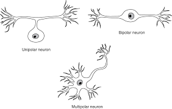
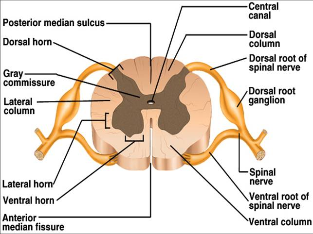

# Cellular Neurobiology
### 8-23
* Textbook not required but recommended.
* Make 2 copies of HW, one to keep one to hand in
* May move to UU 109 - Keep an eye out
* Neurobiology - study of neurons
* (HW) Read chapter 4

## Simple neural circuit - Knee jerk reflex

  * **Patellar Stretch Reflex** - Maintains specific tension and length of quadriceps muscle
      * Tapping below the knee stretches the muscle, contracts to regain original length, foot swings
      * In muscle, stretch is detected by sensory neuron
          * Neuron exists in ganglion, extends a process out to the muscle to sense
      * **Ganglion** - structure containing a number of nerve cell bodies, physical expansion of spinal chord, connects processes out to muscles.
      * **Dorsal root ganglion** - contains the cell bodies of sensory neurons that bring information from the periphery to the spinal cord. Used in stretch reflex
      * **Ganglion/nucleous** - A collection of nerve cell bodies
      * **Process** - (neurite) extends from ganglion to muscle (term used instead of axon/dendrite)
      * CNS - Spinal chord
          * White matter and gray matter (cross section image)
      * **Sensory Neuron** - Detects signals from environment, sends a process to the CNS into the inner gray matter
          * Then interacts with a second neuron at synapse, *motor neuron*
      * **Pre-Synaptic** - Sensory neuron endings, releases neurotransmitters
      * **Post-Synaptic** - Motor neuron, receives neurotransmitters
      * **Motor neuron** - exists in gray matter of spinal chord, sends signals to muscle via process from CNS
      * **Synaptic cleft** - gap, interacts with receptors on post-synaptic cell
      * Motor neuron's response travels out of the CNS to muscle via a process, here it becomes a pre-synaptic contact with the now post-synaptic muscle.
      * Signal leads to contraction
      * Motor neuron then extends a process back to the muscle
      * **Nerre** - Collection of processes, bundle of sensory and motor fibers
      * **Afferent** - incoming signal to CNS - *dorsal root*
      * **Efferent** - outgoing signal from CNS - *ventral root*
      * **Sensory neuron** - synapses with motor neuron are on the motor neuron's *dendrites*
      * **Motor neuron** - extends an *axon* out to the muscle
      * Neuron has *resting potential* - electrical difference between interior and outside. When electrical potential changes,this signal can be sent through the neuron and to the next neuron in line
      * ACH -  neurotransmitter in the preganglionic sympathetic and parasympathetic neurons

## The Neuron

  * What differs neurons from other cells - Shapes
  * **Shapes of neurons** - reflect who they're connected to (long processes for motor neurons can be 3ft long), where they receive inputs and where they send them
  * **Anaxonal neuron** - Difficult to distinguish between inputs and outputs, no obvious axon
  * **Monopolar** - (unipolar) only one process extends from body
  * **Bipolar** - Branch goes up one way and down another
  * **Multipolar neuron** - classic neuron, cell body with dendrites on body and single axon
  * **Interneurons** - process signals between sensory and motor neurons

### 8-25
  * (HW) will be posted today, due next week wen. Make two copies
  * **Neuroglia cells** - 2-3 times as many than neurons. 5 kinds
    * **Astrogilia** - look like stars, common. Provide physical support and nutrients for neurons. Regulate k+ conc outside nervous system. Remove excess neurotransmitters from extracellular space.
    * **Radialgilia** - Around throughout life of org, important in development. Provide scaffold for migration of neurons.
    * **Microgilia** - immune response. made in bone marrow, highly mobile. clean up cellular debris, see a lot near infections or neurodegenerative diseases (Parkison's, Huntington's, Alzheimer's). Excessive activity during development may remove too many synapses leading to issues like possibly autism??
    * **Oligodenetroglia** - found in CNS (brain, spinal cord) only, generate _myelin_ (flattened cell membrane w/o plasma) from glial cell. Electrical insulator, allows action potentials to move quicker and more reliably. Each _oligodentrocyte_ myelinates several axons. Block axon regrowth on damage.
      * **Nodes of Ranvier** - nodes where AP are generated, gaps in myelin.
    * **Schwann cells** - glial cells outside the CNS, in the PNS. Provide myelin. Myelantes only _one_ axon. Takes own cell body and wraps around, squeezing out most cytoplasm. Help regenerate nerve damage.
    * Difference between _Schwann cells_ and _Oligodentrocyte_:
      * Schwann cells help regenerate nerve damage
      * Oligodentrocytes actually block axon regrowth. Complex issue.
        * Oligodentrocytes block axon regrowth because it prevents mistakes that could be made during regrowth.
    * Similarities between gilia and neurons:
      * Electrical potentials across membranes exist in both
      * Change in response to signals - electrical and neurotransmitters
      * Glial cells are electrically connected to each other and can be connected ot neurons as well
    * Differences between gilia and neuons:
      * Glial cells electrical potential changes are much smaller
      * Glial cells do not have AP
      * Glial cells have smaller cell bodies and are smaller

## Organization of Neural structure
  * Even single cell organisms have some type of nervous systems.
  * **Nerve net** - Networks of interconnected neurons, can have activity that spreads throughout the net. Found in Hydras.
    * Humans have similar arrangements of nerve cells in gut (peristalsis)
  * Most invertebrate animals have a brain and nerve cords, large ganglic along the nerve cord
  * Mammals and other vertebrates also have brain and nerve cord. also have ganglic
  * But invertebrate nerve cords run along the belly side, vertebrate along the _back_ and system is made from a tube and remains tube-like
  * Basic Organization
    * CNS - Brain + spinal cord
    * PNS - Nerves that run to and from organs and muscles, includes nerves and ganglia
    * **Enteric Nervous System** - network of neurons and ganglia on the gut
  * Brains integrate information from a collection of sensors at the front end of the animal

### 8-28, 8-30
## Major parts of the brain
  * **Dorsal** - Back or top of animal
  * **Ventral** - Belly or bottom of animal
  * **Anterior** - Front, head
  * **Posterior** - Back, legs
  * **Rostral** - Toward the nose
  * **Coudral** - Toward the tail
  * **Lateral** - to the outside
  * **Medial** - Toward the midline
  * **Proximal** - used in reference to another object, closer object to intended object you are referring to
  * **Distal** - used in reference to another object, further object to intended object you are referring to
  * **Superior** - above (in brain)
  * **Inferior** - below (in brain)
  * Sections of the brain:
    * **Coronal** - sliced like a sausage, front and back of brain
    * **Saggital** - split down midline, corpus callusom, so you get two mirror image halves
    * **Transverse/Horizontal** - cut on plane parallel to ground while standing, split into top half and bottom half. Used in midbrain and spinal
  * Nervous system starts as a tube
    * As time progresses, portions of the tube develop in different ways
    (INSERT IMG)
    * Starts with a tube with forrbrain, midbrain, hindbrain, and spinal cord
      * **_Forebrain_** develops first. Telencephalon and Diencephalon.
        * **Telencephalon** - Higher mental functions. Processes sensory info and motor control. Two cerebral hemispheres connected by corpus callosum. Contains 4 lobes of the brain determined by brain folds
          * **Gyrus** - mountain fold of brain
          * **Sulcus** - Valley fold of brain
          * **Corpus callosum** - big myelinated bundle of axons that connects hemispheres
          * **Frontal lobe** - Personality, "higher mental functions"
          * **Parietal lobe** - Behind central sulcus
          * **Occipital lobe** - Back end of brain, visual processing
          * **Temporal lobe** - Ventral to other lobes, around your temples. Hearing and speech
          * **Basal ganglia** - Ganglia, interior of cortical folds (not part of cortex), important in postural adjustments and planning movements. Putamen, globus pallidus, caudate
          * **Lymbic system** - Amygdala, Hippocampus, Nucleus accumbens
            * **Amygdala** - area of emotion, rage, repulsion, fear
            * **Hippocampus** - Memory is formed
            * **Nucleus accumbens** - reward/pleasure circuit. Plays role in addiction, other non destructive behavior.
          * HM - surgery at age of 27, removed hippocampus, could not form new memories
          * **Olfactory bulb** - Chemical sensors in nose project to bulb, underside of brain. Neurons project to olfactory cortex.
        * **Diencephalon** - Thalamus, Lateral gerniculate, Medial geniculate, hypothalamus
          * **Thalamus** - Sensory processes and distributes most sensory and motor information to and from the Telencephalon
          * **Lateral gerniculate** - Visual processing, receives information from the retina, conveyed by the optic nerve.
          * **Medial geniculate** - Processes auditory information
          * **Hypothalamus** - below the Thalamus, important for homeostasis. Regulates hormone secretion using pituitary(body temp, blood pressure, salt balance), regulates behavior for eating drinking, thirst, salt consumption, shivering
      * **_Mesencephalon_** - Midbrain. Relay station for visual (superior colliculus), auditory (inferior colliculus), nuclei.
        * **Superior colliculus** - visual relay station in midbrain
        * **Inferior colliculus** - auditory relay station in midbrain
        * **Red nucleous** - relay station between cerebellum and fuebrain
        * **Subdtantia nigra** - postural and motor control nuclei, where cells die in parkinson's disease
        (IMAGE here)
      * **_Hindbrain_** -  2 devisions, Metencephalon and Myelencephalon
        * **Metencephalon** - Pons and cerebellum
          * **Pons** - Major fiber tract. Pathway to and from cerebellum and hindbrain. Has some nuclei which control respiration and sleep.
          * **Cerebellum** - Maintain muscle tone and balance. Helps in planning out movement smoothly. Motor memory.
            * Receives information from cerebral cortex indirectly about planned movements. Receives info from cerebral cortex about sensory feedback from movement as well. Cerebellum compares these pieces of information to make sure movement happened correctly, generated correction
            * **Motor error** - signals indicate incorrect motion compared to intended motion in cerebellum, correction is then made
            * Output from _cerebellum_ is carried by the axons of the _Purkinje cells_, is inhibitory, goes to deep cerebellar nuclei. From here it goes to cerebral cortex where corrective movements are generated if needed.
            (IMAGE here)
            * **Pontire nucleous** - receive info about _intended_ movement. Extend out into mossy fibers which synapse with granule cells. Granule cells send up its own axon that synapse the _Purkinje cells_ using parallel fibers.
            * **Inferior olive of Myelencephalon** - Gets input about _actual_ movements, synapse with _Purkinje cells_ using climbing fibers, wrap dendrites.
            * **Deep cerebellum nuclei** - gets info from _Purkinje cells_ about actual and intended movements; output corrected movement is sent to motor cortex if needed.
            * Damage to cerebellum - intended movement is jerky
        * **Myelencephalon** - _Medulla oblongata_, continuation of spinal cord. Blood rate, breathing, coughing, gagging. Controls basic functions, required for survival.
### 9-1
## CNS
  * Coming off the brain on its ventral side are 12 cranial nerves, go between brain and periphery
    * **Optic nerve(II)** - lateral geniculate to eye
  * Spinal cord is CNS that is more directly innervating
  * x-section(transverse) - white matter(mylin axons) and grey matter(cell bodies)
  (IMAGE)
  
  * Central canal, Dorsal horn and ganglia, ventral horn and ganglia
  * Spinal cord shows some basic features of the CNS
    * Tubular nature, continuous with ventricles in brain, central caral of spinal cord
      * filled with and surrounded by cerebrospinal fluid _CSF_
      Contains the correct ionic balance for neural functions and a few proteins
        * Produced from blood in _chorid plexus_ in addition to ionic balance, its important as a shock absorber
    * Grey and white matter
  * **Meninges** - Surrounding the CNS, set of 3 membranes
    * CSF bathes the CNS inside the meninges "sheath"
    * CSF reabsorbed at the meninges
  * **Blood brain barrier** - also regulates what ions/proteins reach brain
    * Capillary endothelial cells in CNS are joined by the tight junctions. Stuff cannot exit or enter these capillaries unless they pass through endothelial cells membranes.
      * small lipid soluble molecules, water
      * Transporters in the cell membrane can move molecules
        * Glucose transporter
    * _Astrocytes_ play a role, structures (feet) extend and surround capillary. Secrete molecules/proteins to stimulate endothelial cells of capillaries to regulate tightness of  tight junction, regulate permeability of blood brain barrier.
    * To get drugs to CNS, must deal with BBB
      * tiny and lipid soluble ok
      * or attach to nano-particles which get transported
### PNS - Autonomic nervous system
  * also includes peripheral nerves
  * 3 major divisions
    * Sympathetic
    * Parasympathetic
    * Enteric
    * For S and PS, many of the cell bodies are in the CNS
      * **Sympathetic** neurons in spinal cord send axons out of cord to sympathetic ganglion where a synapse is made
        * Preganglionic fiber, neurotransmitter is *ACH*
        * Postsynaptic cell in the sympathetic ganglion extends axon to organs (postganglionic fiber), long. Neurotransmitter is *norepinephrine*
          * **norepinephrine** - fight or flight, causes effects like inc hr, inc blood flow to muscles, sweat, inhibit digestion, mobilizes glucose, activates adrenal glands, dialates pupils.
      * **Parasympathetic**
        * nerve bodies in CNS but in brainstem and in the sacral region of spinal cord
        * sends axons (preganglionic fibers) out to ganglia which are close to or on the organ innervated
          * long preganglion fiber, short postganglionic fiber
        * *ACH* is neurotransmitter in ganglia, AND uses **ACh** postganglionic, not NE like in Sympathetic
          * rest and digest, inc blood to gut
          * reduces blood flow to muscles
          * slows hr
    * **Enteric**
      * Nerve net with ganglia throughout
      * Neurons interact with each other for peristalsis
      * Many neurotransmitters

### Anatonomy in neurons
  * **Neuronal membrane** - Phospholipid bilayer. Phosphate head is hydrophilic
  * Proteins ca move a bit, some cant move that much.
  * Proteins in neurons
    * Transport proteins
    * Ion Channels
      * Can be gated - needed something to open
      * Ligand, voltage, stretch-sensitive
    * Membrane can have very different
      * [K+]out 3mM, [K+]in 90mM
      * By diffusion, prefers to exit(concentration), but prefers to stay inside because its more negative (electrical gradient)
      * _Nernst equation_ is used here - calculate membrane potential based on [ions] inside and outside cells
      * membrane potential **Vm** -  constant * [k+]out/[k+]in, 8.31 j/mol*K, Rt/zf
        * t is temp in K (273+celcius, ~293)
        * z = valance of ions
        * F - faraday's constant 96500 C/mol
        * **Constant of 25 mv** - assuming temp is 20C and valance of 1. Needs to be multiplied by ln of concentration gradient
          * 25mV ln( K+out/k+in)
          * if permiable membrane,  this is the potential.
          * example : (25mV)ln( 3mM/90mM) = -85mV
            * use 58 instead of 25 if use log base 10
          * usual mammalian cells have out 106mM,in 4mM
