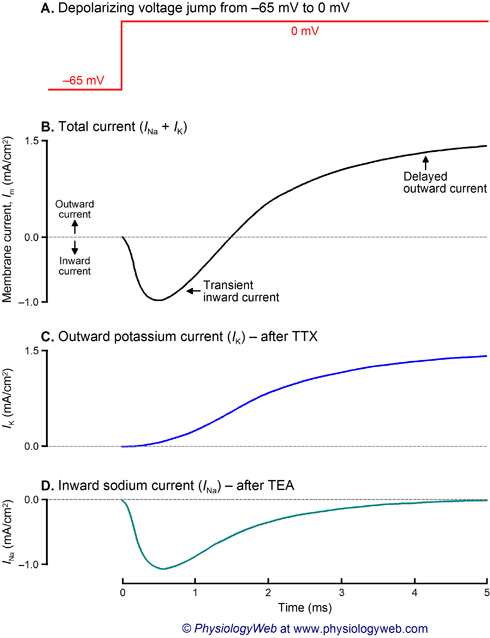

# Cellular Neurobiology

* Na+ is 20 times more permeable than K+ at AP - how do we know?
  * **Voltage clamp** - allows you to measure how permeable a membrane is and how ions are moving across it in real time. 2 electrodes needed inside cell. One to measure Vm, one to pass current.
    * one electron to measure Vm - info sent to voltage clamp circuitry
    * **Command voltage** - you tell the circuitry what you want Vm to be
    * **Voltage clamp circuitry** - look at Vm is, where you set it (command voltage), then pass current into cell to make them match using the second electrode
    * What you read out of the _voltage clamp_ is the _current_ it must pass into the cell to hold Vm at a certain level
    * Counteract current(I) from increased Vm from clamp. if AP threshold is not met, current only slightly changes to oppose current. Above threshold it activates an AP
    * Current over time plot:
    (IMAGE) instead of Vm over time of an AP, in a voltage clamp where we set Vm above threshold:
      * I over time, outward above 0, inward below 0

    * **Current during action potential measured by clamp:**


```
            |           / ------------- \
 Outside    |          /                 \
        I  0|-------------------------------------------------
  Inside    |  \ ----/
            |
```

* **Set Vm to -40 in squid (below threshold at -20)** - Small inward current, no outward current

```
            |
        Vm  |   |---------|(-40)
            |---|         |---------(-60)
            |
            |---------------------------

            |           
            |         
        I  0|-------------------------------------------------
            |   \--------/''''' (Overall inward current)
            |
```

* **Set Vm at threshold** - Initial normal inward and outward current.

```
            |   |---------|(-20)
        Vm  |   |         |
            |---|         |---------(-60)
            |
            |---------------------------
                         __________
            |           /          \
            |          /            \ (Sustained outward)
        I  0|-----------------------------------------------
            |   \____/ (initial inward of Na)
            |
```

* **Set Vm to +26mV** - compared to setting at threshold, smaller inward current and larger outward current
    * because driving force on Na+ when Vm is +26
      * df = vm - E_ion
      * 26mV - 55 = -29mV
    * while at -20mV for Vm
      * df = -20 - 55 = -75mV
    * For Na+, driving force is less at +26mV so inward current it carries is less
    * BUT for K+, at Vm = -20, df is -20 -(-75) = +55mV
      * but when Vm = +20mV
      * df is 26mV -(-75) = +101mV, Much bigger!!


```
            |   |---------|(+26)
        Vm  |   |         |
            |   |         |
            |---|         |---------(-60)
            |
            |---------------------------

                          ________
            |            /        \
            |           /          \
            |          /            \ (Larger sustained outward)
        I  0|-----------------------------------------------
            |   \----/ (smaller initial inward of Na)
            |
```

* **Set Vm to +55mV or Driving force of Na+(ENa+)** - No inward current, just outward
  * df = 55-55 = 0 mV
  * No inward current at all but a large outward current because we are even further from eq potential for K+


```
            |   |---------|(+55)
        Vm  |   |         |
            |   |         |
            |---|         |---------(-60)
            |
            |---------------------------

                          ________
            |            /        \ (K+ leaves)
            |           /          \
            |          /            \ (Even larger sustained outward)
        I  0|-----------------------------------------------
            |   (Na+ neither comes in or leaves)
            |
```

* **Set Vm to +65, 10 mB more positive that Ena+** - Two outward currents, no inward
  * df = 65 - 55 = +10mV
  * Two outward currents

```
                             ________
            |               /        \
            |           __ /          \ ( K+ leaves)
            |          /               \ (Even larger sustained outward)
        I  0|-----------------------------------------------
            |        ( ^ Na+ leaves)
```


* You can determine resistance of membrane V = IR - ohms law
* **Conductance** - the inverse of resistance:  G = (1/R)
* By calculating G over AP, you can see:
  * **Conductance(G) of Na+** - high at beginning of AP, lower later during AP - V-gated channels and soon close
  * **K+ conductance(G)** - high and peaks later than Na+ in AP - V-gated channels open with a slight delay and stay open for a while
* How can you differentiate between which ions are responsible for which currents?
  * Can v-clamp to Eion and should eiminate net current for ion. But problem for this. While it will work for Na+, if you v-clamp Ek+,this is so negative(-) that Na+ Channels wont open so you don't see any net current, need to set off v-gated channels
* **TTX (Tetradotoxin)** - blocks Na+ channels. No inward Na+ flow, outward only. WE can now see how changing [K+] in and out can affect driving force.
* **TEA (Tetraethyl Ammonium)** - blocks v-gated K+ channels, only inward current.  
* **B toxin from scorpians** - causes Na+ channels to open at more (-) Vm than normal.Open sooner for lower Vm. V-clamp graph looks similar but the entire thing is shifted down toward inflow.
* **B toxin and TEA** - stronger inflow, no outflow
* **B toxin and TTX** - No inflow, normal outflow.
* **Driving force** - tells you the strength of the forces acting on each ion, it is the difference between the membrane potential and the ion's equilibrium potential. df = V_m - E_ion (membrane potential - equilibrium potential)
* **Dendrotoxin** - Causes massive firing of pain fibers, Vm is more depolarized than normal. Only influx, no outflux. Blocks K+ channels only, no affect on Na+ channels.
* **Dendrotoxin with TTX** - no net current in or out.
* **Dendrotoxin with TEA** - Normal in current only.

* **Patch clamp can be used as a voltage clamp** - Smooth pipette electrode is brought to cell membrane and sealed, allows you to record activity of all the channels inside the edges of the pipette.
* Patch clamp records 100's of brief recordings that show activities of a few channels in presence of TEA, to block K+
  * See these at various times in different recordings, but if you sum up the activity over 100s of these recordings, it looks like a 'typical' TEA treated inward current

```
            |         
        I  0|-----------------
            |    |-|   (Brief inward current that turns on and off)
            |          


            |         
        I  0|-----------------
            |    \___/   (Typical TEA treatment inward current)
            |
```


* **Block channels with TTX, patch clamp reading** - Patch clamp with voltage clamp conditions well above threshold
  * Confirms that A.P. is due to an inward current carried by Na+ that shuts off, a slightly delayed outward current carried by K+ that is long lasting

```
                  ____________
      out   |    /            (long lasting outward current)
           0|-----------------
      in    |    
            |          

            |    |-|      (individual channels are opening longer than Na+ channels a lot)
           0|-----------------
            |    
            |     
```

* **4 types of v-gated channels have been identified** - Na+, K+, Ca++, Cl-
* **K+channels are most** - varied in properties
* **Molecular features of ion channels** - membrane spanning regions, central pore, loop of amino acids, gate that can be opened or closed
  * membrane spanning regions - with repeated spars
  * a central pore for ions to pass through
  * a loop of amino acids lining the pore, which aids selectivity of the channels
  * also for selectivity, have a constricted region called the selectivity filter
  * some kind of gate that can be opened and closed
    * selectivity can be based on ion size
      * for Na+ and K+ usually hold H20 tightly, Na+ carries 3+ water molecules, K+ carries 2.
      * **We can restrict Na+ from a K+ channels using** - small size, even though Na+ is technically smaller than K+. Water molecule binding(Na+ carries 3+ water molecules, K+ carries 2)
      * **We can restrict K+ from a Na+ channels using** - Magic. Still unknown
      * **Na+ channels** - single protein, 6 membrane spanning regions, each with 4 domains. Voltage sensor may be the S4 helix found in each domain. It is covered in pos charged lysine. Has Activation and Inactivation gate.
        * a single protein transcribed from one gene
          * 6 membrane spanning regions, each organized 4 domains arranged in a ring with a pore down the center
        * Voltage sensor may be the S4 helix found in each domain. It is covered in pos charged lysine.
          * when interior of cell (Vm) becomes more positive, S4 helixes are repelled and move, opening the channels
        * Have 2 gates
          * **Activation gate** - opens as soon as Vm becomes more (+), Na+ passes through the channel. Activation gate eventually shuts off with Vm becoming more negative.
          * **Inactivation gate** - activation gate's opening triggers it to close, shutting off Na+ movement even though the activation gate may still be open.
      * **Ca++ channels** - membrane spanning regions, each with 4 domains, single protein. everal different Ca++ channel genes so several different varieties (like Na+)
      * **Cl- channels** - also from one protein
      * **K+ Channels** - assembled from 4 seperately transcribed subunits. Can be combined to various ways to impart various features on the K+ channel's function much more variability in K+ Channels
      * **K+ Channel in squid axon** - Opens when Vm is becoming +, closes when vm is -
        * **delayed rectifier channel** - K+ channel stays open as long as Vm is positive
        * **The A Channel** - k+ Channel that closes shortly after it opens, Ball and chain idea. Enterance is blocked by ball quickly after it opens
        * **M Channels** - Muscarine activates them, acts similar to delayed rectifier (not Vm)
        * **S Channels** - Seratonin activates them, acts similar to delayed rectifier (not Vm)
        * **Ca++ activated K Channel** - Opens in response to Ca++ inside cell reaches certain level

        * **Bursty Cell** - Membrane depolarizes, crosses threshold, AP fires until Vm drops below threshold again. Usually used for rhythmic activity.   1. Leakage Ca++ channels - responsible for depolarizatio; 2. V-gated Na+ Channels; 3. V-gated K+ Channels; 4. Ca++ activated k+ channels; 5. Ca++ pumps remove excess [Ca++]in
          1. Leakage Ca++ channels - responsible for depolarization as leak into cell, causes crossing of threshold and keeps it there, opens Na+ channels
          2. V-gated Na+ Channels - typical behavior, leads to firing as long as Vm > threshold
          3. V-gated K+ Channels - typical behavior, leads to firing as long as Vm > threshold
          4. Ca++ activated k+ channels - More K+ leaves cell, brings back toward rest
          5. Ca++ pumps remove excess Ca++ inside cell so Ca++ activated k+ channels _close_.

        ```
        55  |      _|__|__
        0   |     /   |  | \
        -60 |----/          \ --
        ```

        * **Channelopathies** - genetic mutations of ion channels
        * **Ca++ Channels are sometimes mutated** - can be truncated and lead to abnormal limb movement, nausea, headache, vertigo, brought by stress and stops after a few hours
        * **Na+ channel mutation** - can lead to seizures, one tpye is only in children, stops in puberty
        * In muscle - **Myotonia congenita** - mutation of Cl- channel, Cl- channels keep Vm below threshold. When animal wants to carry out muscle action, muscle depolarizes and contracts, without proper Cl- function it keeps depolarizing and, "seizes up" and animal freezes
        * AP Propagation
          * generated on one patch of membrane
          * + charge moves away from spot since it is repelled and natural diffusion
          * AP is generated nearby because AP at first site is still in refractory period, AP at section 2 cannot go back to 1, propagates down the axon instead.
          * How quickly the AP can move depends on how easily charges can move within it
            * **internal resistance of the cytoplasm** - is _Ri_
            * Larger diameter, lower resistance
            * Squids have large axons to conduct AP's rapidly
            * Giant axons are fast as well
          * speed also depends on leakage
            * leaky membrane, charges are lost and dont move as fast
            * leaky membrane is one with plenty of open ion channels got charges to exit
            * **conductance g is hight Rm** _Rm_ = 1/g_m
          * **length constant (lambda)** - the distance a given charge in Vm can travel before declining to a certain level, lambda = sqrt(Rm/Ri)
            * how far an AP spreads
            * lambda is the distance the charge in Vm can travel before it declines to Ve of it original value.
            * (graph) at 0, inject current and change Vm (exponential decline on either side)
            * **Rm** - how easily charges cross membrane
            * **Ri** - determines how easily charges move inside

          ```
            |          /\
            |         /  \
        Vm  |     __ /     \\ __   <- (Vm = Ve)
  (rest   _ |____/              \ ____
            |
            ------------------------
                  Distance (microns)
          ```

          * **Time constant (Tau)** - a different set of factors determine how quickly the charges can change Vm (To reach threshold if you want to  generate an AP). Depends on membrane capacitance **Cm**
            * Charge outsize the membrane detect charges inside the membrane (because membrane is thin), they will line up inside to counteract them (because opposites charges attract). Nothing can cross the membrane until internal and external charges have balances each other across the membrane.

            ``` Neuronal membrane:
              (outside axon)
              + + + + + +
              ___________ <- chargable plate
                          <- (non conductive)
              ___________ <- chargable plate
              - - - - - -
              (inside axon)
            ```

            * Becasue of Cm, a sudden change in Vm due to you injecting current into an axon, you inject this current  
            ''' I = ___|-----|___'''
            * The axon membrane sees this:
            ''' Vm = ___/----\___'''
            * This is due to the capacitance
            * **Tau** - Tau = Cm*Rm, tells  you how long it takes for Vm to reach 1 - 1/e of the  final Vm
            * **To optimize speed of AP** - you would want a long lambda and a short _time constant_, but Tau = Cm*Rm and lambda = Rm/Ri
          * **What is the role of myelin** - small Cm of myelin lowers the Tau (time needed for charges to move) and raises the lambda (distance traveled) as charges don't leak back out
            * electric insulator
            * Thick enough so charges inside axon cant detect charges outside axon
            * At nodes with no myelin, axons have a high conc of v gated Na+ channels, therefore lower thesholds
            * very few v-gated Na channels remain under myelin, K+ channels more evenly distributed. But myelin blocks channels
            * the small Cm of myelin lowers the Tau ( time needed for charges to move) and raises the lambda as charges dont leak back out
            * So a Vm Change  at one point  on a myelinated axon can move farther, faster than one on unmyelenated axon.
          * Space constant -
* Types of transmission
  * **Electrical Synaptic Transmission** - ionic charge moves directly between neurons through channels (Connexons)
    * **Connexons** - located on membranes of the pre and postsynaptic neurons, which meet at a gap junction. Pre synaptic cell line up with post synaptic cell connexons to make a channel. Made up of 6 subunits with a channel down the middle. This is often not a very specific channel, ions flow either direction.
      * Current from neuron a can be recorded at neuron b and vice versa.
      * The current you record or charge in Vm in the postsynaptic cell can be recorded with almost no delay
      * You don't need an AP in the presynaptic cell to get detected in the post synaptic cell, a sub threshold signal will still pass
      * Signal will be reproduced in postsynaptic cell. It can be depolarizing or hyperpolarizing
    * Electrical synapses are fast, reliable, have some flexibility
      * seen in escape circuits  - allows animals to make quick getaways
      * where you want to coordinate groups of neurons
  * **Chemical** - synapses offer flexibility, synaptic cleft is a physical space between neurons, uses neurotransmitters
    * synaptic cleft is a physical space between neurons
    * presyn neuron shows synaptic vesicles containing neurotransmitters
    * signal passes only from pre to post
    * post signal can be different from pre
      * pre AP can turn into a hyperpolarization post
      * pre AP can turn into  an amplified post AP
    * **Synapse needs extracellular** - Ca++ to pass a chemical signal. Substituting Mg++ for Ca++ in saline will block synaptic transmission
    In a chemical synapse, the receptor on the post membrane is an important factor in what the post cells response will be to  whether excitatory or inhibitory strong or weak etc.
    * Overview of what happens at an electric synapse
      * pre cell depolarizes (hyperpolarization)
      * ionic charges move from pre->post cell
      * postsynaptic cell shows similar response to presynapctic with minimal delay
    * Chemical synapse
      * pre cell depolarizes
      * Ca++ enters the pre cell terminal
      * pre releases neurotransmitter
      * neurotransmitter diffuses across the synaptic cleft
      * binds a receptor for it on the postsynaptic membrane
      * neurotransmitter bound to that receptor opens an ion channel (or close it)
      * neurotransmitter is either taken back into presynaptic terminal or broken down or somehow dislodged from its receptor to end the signal
    * Takes about _half a millisecond_, longer than electrical
    * model system for studying the chemical synaptic transmission is ACh at the neuromuscular junction
      * Motor neuron fires a AP , muscle cell responds with a depolarizarion if large enough to cross threshold, the muscle cell will fire an action potential
      * depolarization the muscle cell shows is called the endplate potential _epp_ or _psp_ (postsynaptic potential)
      * **PSP** - transient change in membrane potential,can spread a lot depending on space and tome constants is this is large enough to generate AP
        * **epsp** - excitatory postsynaptic potential
        * **ipsp** - inhibatory postsynaptic potential
        * Ligand gated channels opened by neurotransmitters, not voltage
        * What kind of ions pass through the ligand gated channel?
          * for ACh at neuromuscular junction:
            * voltage clamp postsynaptic cell causes currents to flow when you apply ACh
          * suppose you set Vm to different level - each time,apply ACh to open channels and look at currents
          * If the channel allows only Na+ to pass, you would predict no net current flowing at ENa+
              ```
              | ( v ACh added)
              |
              |-------------------------------
              |   \___/ (inward current)
              |

              |
              |   (depolarization)
          Vm  |    ____
         rest |---/    \---------------
         -60  |____________________________
          ```
          * No net K+ flowing out

          ```
              | ( v ACh when Vm= -75)
              |
          0   |-------------------------------
              |   \   / (inward current)
              |    \_/

              |
              |  (larger depolarization)
          Vm  |    ____
         -60  |---/    \---------------
        -75   |____________________________
          ```

          ```
              | ( v ACh when Vm= -10)
              |
          0   |-------------------------------
              |   (no net current)
              |    

              |
              |
          Vm  |   
          -10 |--------------------------
          -60 |____________________________
          ```
          * flow in  = flow out of Na+ and K+


          ```
              | ( v ACh when Vm= +10)
    out       |    ___
          0   |---/   \------------------------
              |   (no net current)
              |    

              |
          10  |----\___/------------------
          Vm  |   
              |
              |____________________________
          ```
  * This happens because **Ach opens a channel that allows passage of** - both Na+ and K, but k flows out
  * **Reversal potential** - is Vm where the Na+ entering is balanced by K+ exiting and there is not net current. Will see no change in Vm when apply ACh. Vrev = Ena + Ek /2, or Vrev = n(Ena+) + (Ek+)/ n+1 [how many more times Na+ is permiable over K+, if K+ is more either use a frac or move n in front of ek+]
  * Vrev in this case when PNa+ = PK+
    Vrev = Ena + Ek /2 -> halfway between equilibrium potentials
  * V = IR, V is voltage from battery (driving force on ion), I is current ion carries, R is 1/G conductance of membrane to ion
    * for ion A, V = Vm - Ea) = Ia(1/gn)
    * Ia = ga(Vm - Ea)
    * At Vrev, Ia = -Ib for no net current
    * for ACh gated channel at neuromuscular junction INa = -IK
    * At Vrev, Vm = Vrev so we can say Ina = -Ik
      * gna(vrev - Ena) -gk(Vrev-Ek)
      * Vrev-Ena = (gk (Vrev -Ek) )/ gna
      * if gNa =G k+
        * Vrev - Ena =-Vrev + Ek+
        * 2Vrev = Ek + Ena
        * Vrev = (Ena + Ek) /2
    * What if the channel is permiable to 2 ions but its more permiable to one ion than the other.
    * If say gNA is n times greaterthan g k then (gk) n = gna
      * and then in this case (gk+)n = gna+ so can substitute (gk+) for gna+
        * (gk+)n(Vrev - Ena+) = - gk+(Vrev - Ek+)
        * You end up with Vrev = n(Ena+) + (Ek+)/ n+1 [how many more times Na+ is permiable over K+, if K+ is more either use a frac or move n in front of ek+]
    * for an epsp, Vrev is aor above threshold
    * for an ipsp, Vrev is below threshold. "guess"timate threshold is around -20mV
* **Molecular Structure**
    * **Molecular structure of ACh gated receptor** - can be isolated in neuromuscular junction. 5 Subunits: 2 a, 1 b, 1 d, 1g.
    * **Nicotinic ACh receptor** - Binding sites on a subunit, needs 2 ACh molecules, one at each subunit. Provides EPSP.
    * Change occurs when ACh bind variation in ACh receptor cannel - due to different combinations of subunits.
    * Variations exist in ACh channels (fetal muscle has different subunit combinations compared to adults)
    * **Metabolic ACh gated channels**- like the muscarinic receptor
    * **alpha bungarotoxin** - Toxins target nicotinc ACh receptor, binds irreversibly
    * **EPSP**- Above threshold
    * **IPSP**- Below threshold, Cl- and K+ moving through a channel could create a IPSP.
    * **When will a IPSP occur?** - Happens when Vrev is below threshold, as Vm will move torward Vrev when channel opens.
 * Other neurotransmitters:
  * **GABA** - inhibitory neurotransmitter
  * **GABA channel structure** - gated channel has 5 subunits, GABA binds to b subunit. Opens channel for Cl-
  * **Drugs on GABA** - Some drugs bind to secondary sites that enhance opening. Barbituates and tranquilizers.
